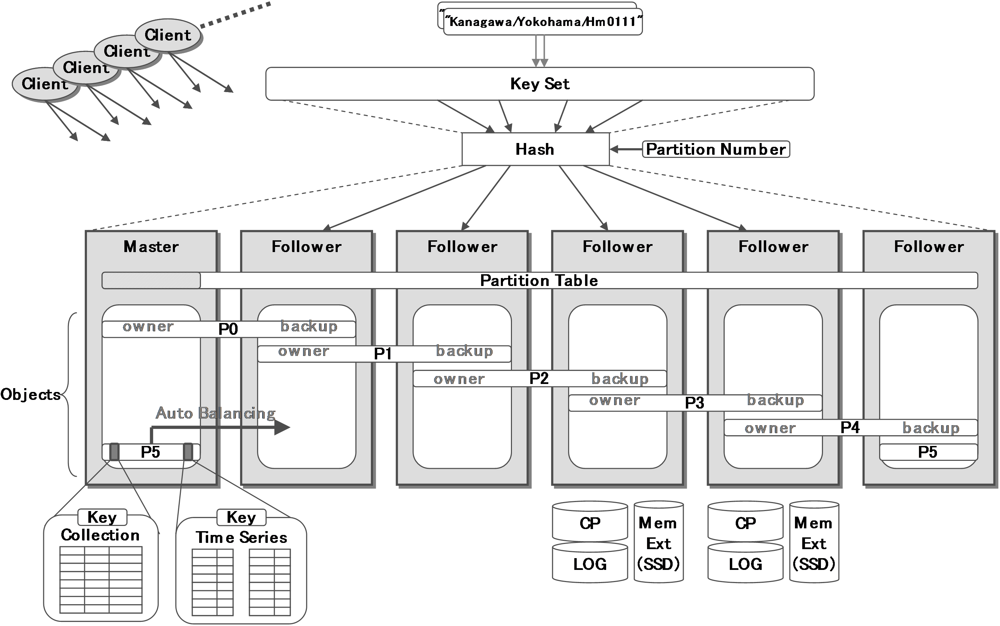
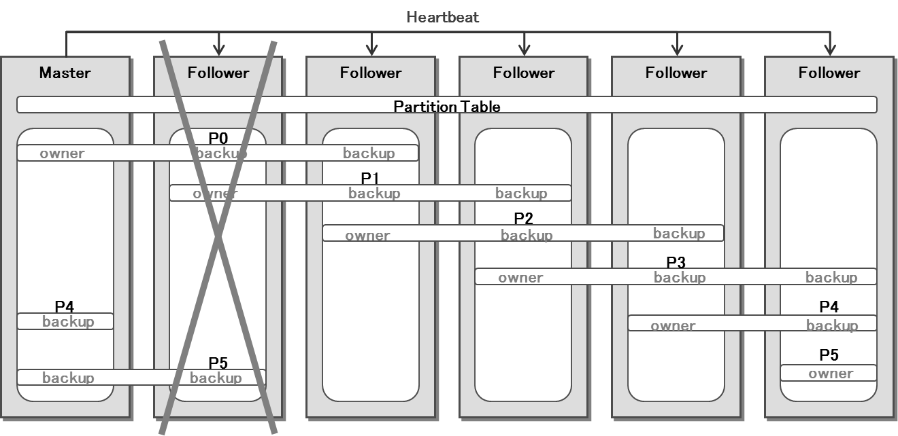
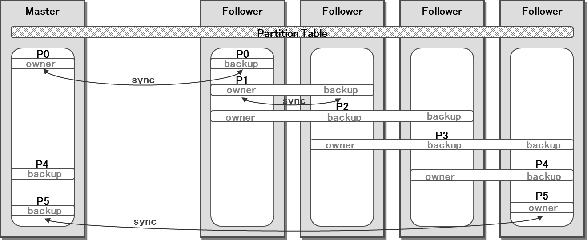

# GridDB Technical Design Document Version 1.0

## 1. Concept of GridDB cluster

A distributed key-value type database using multiple key-value type database nodes can manage a large amount of data which cannot handle　by a single key-value type database node.
GridDB is one of a distributed key-value type database.

A value of GridDB is called “Container”. A data set called "ROW" is managed by using a container. A container can handle two types of collection and time series. A key in GridDB is a primary key to a container. DB cluster consists of connecting multiple database nodes.
　
A cluster is classified into master-slave type and peer-to-peer type.

###### Master-slave type:
It is a cluster which consists of a master node which manages a cluster, and multiple database nodes which store data. Since the master node is a single point of failure, it is necessary to redundant master node in order to ensure the availability of the cluster. Moreover, when the number of database nodes increases, there is a problem that the load of the master node becomes high.

###### Peer-to-Peer type:
All nodes which constitute DB cluster are homogeneous with the same function. Since each node operates according to fragmentary node information, as compared with a master-slave type, data reconstruction is hard to be optimized. There is a problem that the overhead between nodes is large.

GridDB is a hybrid system of a master-slave type and a peer-to-peer type. All nodes which constitute DB cluster are homogeneous with the same function.

A master node is autonomously determined, when DB cluster is constructed. The other nodes in the cluster are called a follower node. When the master node is downed, a new master node is determined from the surviving nodes. In order to avoid the split brain problem by network partitioning, the number of nodes which constitutes DB cluster must be more than a quorum.

A partition is a logical area which stores containers and it is not directly visible from a user. Although the partition can create multiple, the number of partitions must be the same value on all the nodes in the cluster. All the containers belong to either of the partition sets using the hash value to a primary key.

One owner node and zero or more backup nodes exist to each partition. Furthermore, the node called the catch-up node to be promoted to a backup node in the future may exist.
　
An owner node is a node which can update a container. A backup node is a node which holds the replica of the container and enables only reference operation to the container.

An allocation table of the node to each partition is called a partition table. A master node distributes this partition table to follower nodes or client libraries. By referring to this partition table, the owner node and backup node to a certain container can be known.

As mentioned above, a role for a GridDB node is a two-tiered.
1. master node / follower node
2. owner node / backup node / catch-up node

## 2. Determination of a master node
### 2.1. Determination procedure of a master node

In GridDB, a master node is autonomously determined using a bully algorithm. An election message is transmitted and received between nodes, and when a certain node receives the message from a node stronger than a self-node, it returns the response a follow message that follows the opponent. Then, the node ends these types of message transmission and reception.

Finally by repeating this procedure, only one node remains undefeated, and the node is determined as a master node. All the nodes which became a loser into this procedure turn into a follower node. In this algorithm, the number of repetitions until determining a master node is logN where N is the number of nodes.

A master node is collecting the information on all follower nodes by the heartbeat of a constant cycle. This communication cost is dependent on the number of follower nodes. Although a heartbeat interval is 5 seconds by default, according to the number of nodes, or network traffic, you may adjust it suitably.

### 2.2. At the time of a master node down

 When a master node in a cluster is downed, a new master node is autonomously determined out of the follower nodes which remained. A cluster configuration is reset when the heartbeat to a master node severs follower nodes. Thereafter, a new master node is determined by the procedure described by 2.1.

⇓

## 3. Determination of partition roll
### 3.1. Owner node and backup node

The number of backup nodes of a partition can be specified with a parameter called the number of replicas. When backup nodes exist in a partition, replication of updating data in an owner node is carried out immediately to all backup nodes.

The method of replication can choose either asynchronous mode or semi-synchronous mode.
In asynchronous mode, when the contents of updating in an owner node are transmitted to all backup nodes, update process is completed. In semi-synchronous mode, the contents of updating in an owner node are transmitted to all backup nodes, and after checking the reception response from all backup nodes, update process is completed. Asynchronous mode is superior in performance of update process, and semi-synchronous mode is superior in availability.

Since replication is carried out to all backup nodes, the processing cost is proportional to the number of backup nodes. If a performance of update process without a backup node is set to 100, a performance of update process with a backup node in asynchronous mode is about 70, and a performance of update process with a backup node in semi-synchronous mode is about 50.

 Failover is performed when a node failure is detected by a heartbeat. When a failure node is an owner node of a partition, a master node determines a new owner node from current backup nodes for the partition table. When a failure node is a backup node, the master node separates the backup node from the partition table, and continues processing.

 The master node newly updates a partition table and distributes it to follower nodes. According to this partition table, synchronous data is transmitted and received between a new owner node and a new backup node, and it checks that the time stamp of both updating log is in agreement. This processing is called a short-term synchronization.

 Since the updating data in the owner node is reflected one by one by replication to the backup node, the data size which should synchronize in a short-term synchronization is slight, and short-term synchronization usually completes in several seconds.

### 3.2. Determination of catch-up node

A Catch-up node is a node to be promoted to a backup node in the future, and it is set up when as follows.

 - The number of backup nodes is insufficient to the number of replicas.
 - The owner node and backup node of a partition have deviation between nodes.

A master node determines a catch-up node to resolve the above case. Then, a data image and an updating log are transmitted to the catch-up node from the owner node. By this, the time stamp of the data which the catch-up node has is brought close to the time stamp which the owner node has.

A master node performs a short-term synchronization between the owner node and the catch-up node, when the difference of the time stamp of the owner node and the catch-up node becomes within a steady value.

It takes about several hours about during the period after starting transmission of data from the owner node to the catch-up node until it is set to the backup node.

## 4. Behavior of a client library

A client library (the following, client) specifies the database node which should be accessed according to the data manipulation demand from application, and requests processing by the executable unit called a statement.

 First, the notice by periodical multicasting from a master node is received, and a master node is specified. Then, a partition is specified based on a hash value to the primary key of the container to operate. Furthermore, a database node is specified with reference to a partition table of a master node, and a statement is performed.

 The information on the master node and the contents of the partition table which came to hand once maintain cash, unless it becomes an error in the case of statement execution. Moreover, holding the connection with the database node established once is continued by a connection pool.  Thus, it is possible to minimize the number of times of an inquiry to a master node and the number of connections to database nodes.

 A client library has a client failover mechanism, in order to guarantee the permeability over a node failure. When a connection obstacle or the contents disagreement of a partition which the client cached are detected at the time of statement execution, cash is repealed, and a statement is rerun until it succeeds. Even if the time set up beforehand passes, when not succeeding, an error is returned to the application.

## 5. Procedure of adding nodes

 By adding a node, a new cluster will be configured automatically. The new node does not have data immediately after adding to the cluster. However, when the master node specifies this node as the catch-up node described by 3.2, the data which other nodes hold automatically is distributed. Then, when the node is promoted to a backup node, the load between nodes is equalized. It becomes possible to carry out scale-out, without stopping a cluster.
